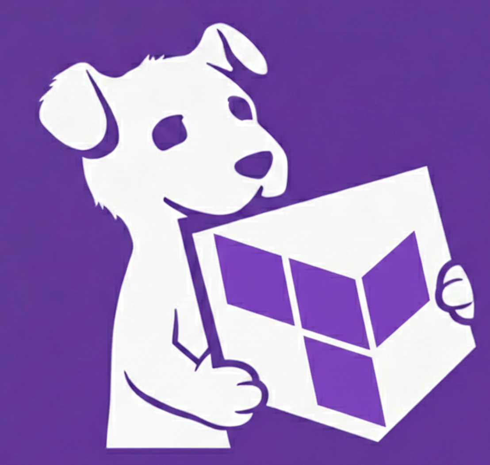

<div align="center">



# DogSTAC

**Datadog Sandbox with Terraform AWS Catalog**

Terraform infrastructure management through a visual web interface.

---

</div>

## Prerequisites

| Requirement | Description |
|:-----------:|-------------|
| **Docker or Podman** | Container runtime |
| **Git** | Used internally to clone instance templates |
| **AWS CLI** | Configured with SSO or credentials (`~/.aws`) |

> [!NOTE]
> The container mounts `~/.aws` from your host, so any credentials configured via AWS CLI — including SSO, profiles, and temporary credentials — work automatically.


If you are trying to use SSO but haven't configured an AWS SSO profile yet:
```bash
aws configure sso
```
Follow the prompts to set SSO start URL, region, account, role, and profile name. Use the profile name when running `./dogstac.sh init`.

## Quick Start

### 1. Download

```bash
mkdir dogstac && cd dogstac
curl -O https://raw.githubusercontent.com/chanhyeokseo/datadog-sandbox-terraform-catalog/main/dogstac.sh
chmod +x dogstac.sh
```

### 2. Initialize and start

```bash
./dogstac.sh init
```

An interactive setup wizard will guide you through:
1. **AWS authentication type** — SSO profile or IAM access key
2. **AWS credentials** — profile name or key pair
3. **DOGSTAC_SALT** — encryption salt for stored configurations

A `.env` file is generated automatically, then the container is pulled and started.

To reconfigure later, run `./dogstac.sh init` again — existing values are shown as defaults so you can keep them by pressing Enter.

### 3. Connect your AI coding tool (optional)

```bash
./dogstac.sh mcp-init
```

Registers the DogSTAC MCP server with **Claude Code** or **Cursor** via an interactive prompt.

### 4. Set up alias (optional)

```bash
./dogstac.sh alias
```

Adds `alias dogstac='./dogstac.sh'` to your shell config so you can use `dogstac start` instead of `./dogstac.sh start`.

### 5. Open the UI

```
http://localhost:7621
```

## CLI Reference

| Command | Description |
|---------|-------------|
| `./dogstac.sh init` | Interactive setup (.env) and start the container |
| `./dogstac.sh start` | Pull latest image and start the container |
| `./dogstac.sh start-no-update` | Start without pulling the latest image |
| `./dogstac.sh stop` | Stop the running container |
| `./dogstac.sh delete` | Stop and remove the container |
| `./dogstac.sh status` | Show container status |
| `./dogstac.sh logs` | Follow container logs (Ctrl+C to exit) |
| `./dogstac.sh mcp-init` | Register MCP server with Claude Code or Cursor |
| `./dogstac.sh alias` | Add `dogstac` alias to your shell config |

## Environment Variables

These are configured in `.env` (created via `./dogstac.sh init`):

| Variable | Required | Description |
|----------|:--------:|-------------|
| `AWS_PROFILE` | * | AWS CLI profile name (SSO or static credentials) |
| `AWS_ACCESS_KEY_ID` | * | Explicit access key (alternative to profile) |
| `AWS_SECRET_ACCESS_KEY` | * | Explicit secret key (alternative to profile) |
| `AWS_SESSION_TOKEN` | | For temporary credentials |
| `DOGSTAC_SALT` | **Yes** | Stable identifier for naming backend resources. Must be unique per user. |
| `TFRUNNER_PORT` | | Backend API port (default: `7621`) |
| `MCP_PORT` | | MCP server port (default: `7622`) |
| `TERRAFORM_DATA_PATH` | | Persistent storage path (default: `./terraform-data`) |

\* One of `AWS_PROFILE` or `AWS_ACCESS_KEY_ID`/`AWS_SECRET_ACCESS_KEY` is required.

> [!IMPORTANT]
> `DOGSTAC_SALT` is **required**. It must be unique per user and remain unchanged after initial setup. Changing it will disconnect you from previously created backend resources.

<div align="center">

---

Backend API docs available at `http://localhost:7621/docs`

</div>
